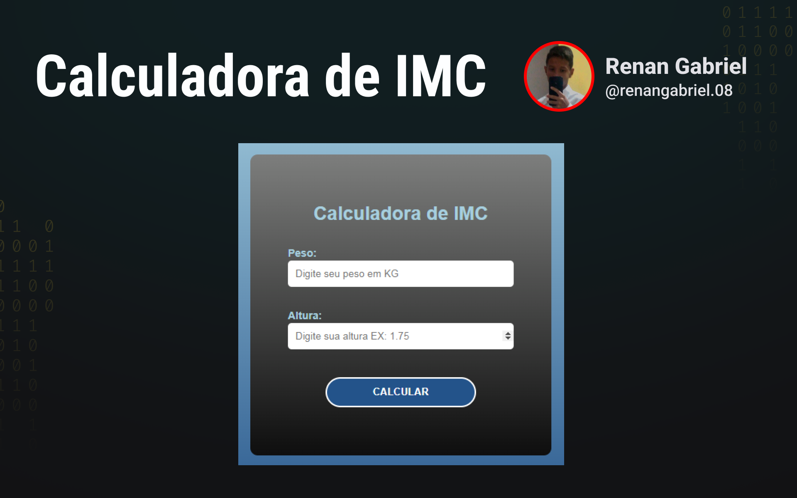

<h1 align="center"> Calculadora de IMC </h1>

Um pequeno projeto de uma calculadora de IMC.

  <a href="#-tecnologias">Tecnologias</a>&nbsp;&nbsp;&nbsp;|&nbsp;&nbsp;&nbsp;
  <a href="#-projeto">Projeto</a>&nbsp;&nbsp;&nbsp;|&nbsp;&nbsp;&nbsp;
  <a href="#memo-licença">Licença</a>

  

 

  

## 🚀 Tecnologias

Esse projeto foi desenvolvido com as seguintes tecnologias:

- HTML e CSS
- SASS
- JavaScript
- Git e Github

## 💻 Projeto

Site desenvolvido para realizar cálculos do índice de massa corporal (IMC).

## :memo: Licença

Esse projeto está sob a licença MIT.

---

- Código desenvolvido por Renan :wave: [LinkedIn](https://www.linkedin.com/in/renan-gabriel/) | [Github](https://github.com/renangabriel08)